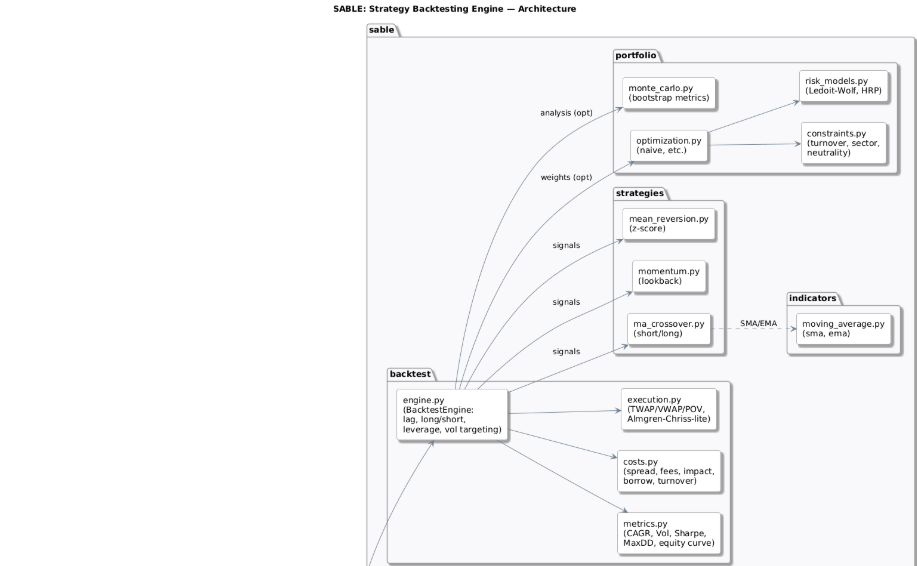

# sable – Strategy Analysis & Backtesting Library & Engine
## Author: Saidou Diallo  
## LinkedIn: https://www.linkedin.com/in/saidoudialloquant/
### PROGRAMS USED
Git Bash • GitHub Actions CI • Docker • Alpha Vantage API
### LANGUAGES USED
Python • Bash (Git Bash) • YAML (CI) • Markdown • Dockerfile  
### SKILLS USED
 Systematic trading research • Time-series CV (walk-forward, purged K-Fold) • Stationary bootstrap • Volatility targeting • Long/short portfolios • Cost/execution modeling • Risk models (Ledoit–Wolf, HRP • Constraints (turnover/sector/beta) • Factor IC/IR * Regime detection • Hyperparameter tuning (Optuna) • Reproducible engineering (CI/Docker)
## SUMMARY
I made a research-grade backtesting platform for equities/ETFs that’s leakage-aware, cost-realistic, and portfolio-centric. It supports classic strategies (MA crossover, momentum, mean-reversion), realistic trading frictions (spread/fees/impact/borrow), volatility targeting, and modern risk/optimization (Ledoit–Wolf, HRP). The name sable stands for Strategy Analysis & Backtesting Library & Engine — short, professional, and exactly what this is.This is for Quant researchers/engineers who need a reliable framework to design, validate, and size systematic strategies with reproducible results. It reduces false positives and overfitting by enforcing walk-forward and purged K-Fold with embargo, preserves time-structure via stationary bootstrap, and reports probabilistic/deflated Sharpe and CIs instead of just a single Sharpe. SABLE emphasizes *correctness under market microstructure*: explicit turnover-based costs, separate spread/fees/impact/borrow; execution schedules (TWAP/VWAP/POV); volatility targeting; HRP/Ledoit–Wolf; regime-aware blending; IC/IR analysis; Optuna walk-forward tuning; CI/Docker for reproducibility.
## VALUE PROPOSITION
SABLE lets you test ideas as they would trade in reality, with leakage-aware validation and explicit execution/cost modeling. It turns research claims into reproducible, defensible evidence (reports, metrics, and CI).
## ARCHITECTURE DIAGRAM

## QUICKSTART (GIT BASH)
### STEP 1 — Set up
python -m venv .venv
source .venv/Scripts/activate
pip install -e .
### STEP 2 — API Key
cp .env.example .env # edit .env and set: ALPHAVANTAGE_API_KEY=your_key_here
### STEP 3 — Run a Backtest
sbe --symbols IBM --strategy ma_crossover --short 20 --long 50 --start 2018-01-01
sbe --symbols IBM --strategy momentum --lookback 126 --start 2018-01-01
sbe --symbols IBM --strategy ma_crossover --short 20 --long 50 --start 2018-01-01 \
    --show_drawdown --show_rolling --html_report auto
    
# Modeling & Methods
Walk-forward evaluation and purged K-Fold with embargo prevent look-ahead and leakage. A stationary bootstrap preserves autocorrelation when estimating distributional properties. Risk/skill use Probabilistic Sharpe, Deflated Sharpe (multiple-testing), and Sharpe CIs. Strategies include MA crossover, time-series momentum, and mean-reversion, with regime detection (k-means) for blending.
# Engineering & Performance
Editable package with CLI (sbe) and clean module layout. GitHub Actions CI runs tests; Dockerfile ensures reproducible environments. HTML reporting captures equity, drawdown, and rolling Sharpe; Optuna scripts provide walk-forward tuning. Vectorized paths keep it fast; the codebase is ready for Numba/JAX if needed.
# Features
Long/short, leverage and gross exposure constraints, and daily volatility targeting. Explicit trading frictions: spread, fees, impact (quadratic), and short borrow; execution schedules (TWAP/VWAP/POV) and simple Almgren–Chriss-style impact. Portfolio construction via Ledoit–Wolf shrinkage and Hierarchical Risk Parity, with turnover/sector/beta-neutral constraints. Factor IC/IR, decay curves, and exposure neutralization complete the research loop.
- Automated testing, CI, and code-quality enforcement for research reproducibility.
The architecture separates core model logic, numerical engines, calibration layers, and visualization tools — ensuring clean scalability and fast prototyping for research or production.
